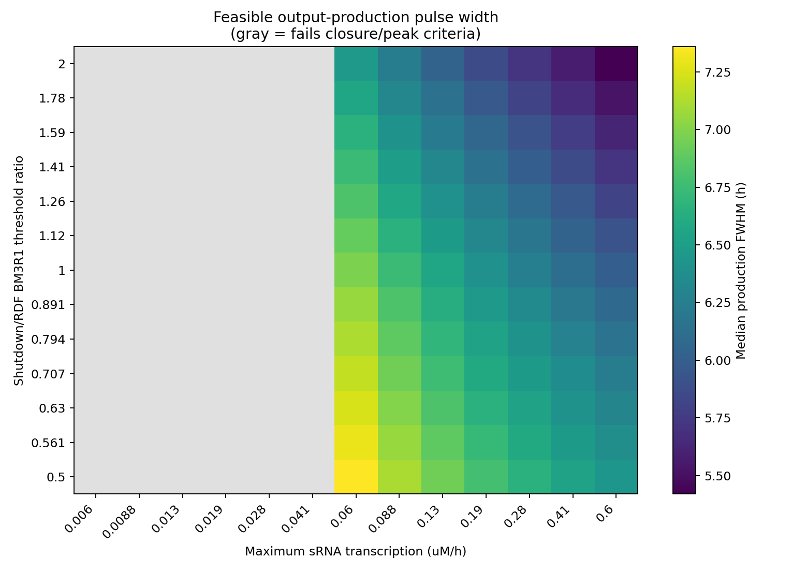
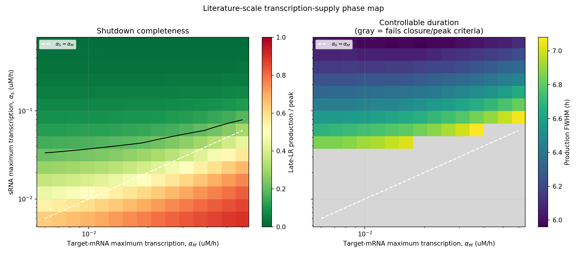
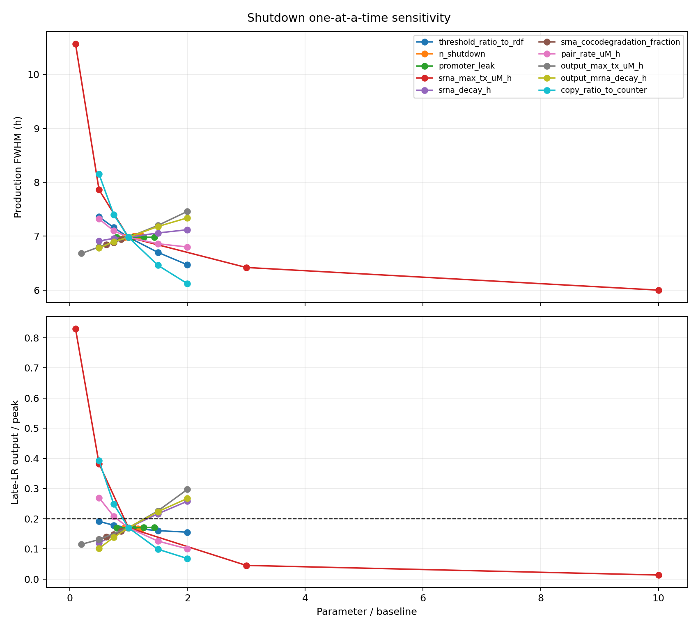
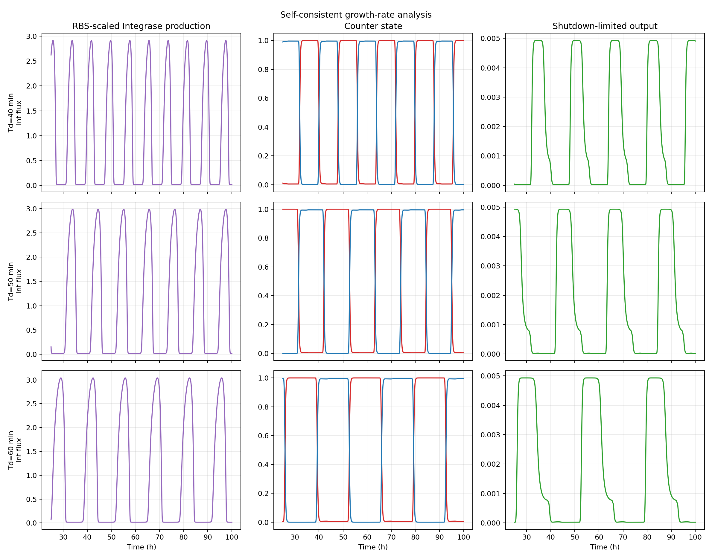

# BM3R1驱动的sRNA Shutdown模块建模报告

**版本：3.3（参数底层来源与单/多bit解释修正版）**  
**日期：2026-09-09**

## 摘要

本研究建立“振荡器 - φC31/RDF计数器 - BM3R1/sRNA Shutdown”耦合模型，用于判断计数器进入LR状态后，BM3R1的延迟下降能否触发sRNA并形成有限、可调的输出产生窗口。本版纠正了旧模型中sRNA配对后只消耗mRNA、未同步消耗sRNA的方程错误，并用Levine等人对 *E. coli* RyhB/sodB系统估计的参数替换原先的探索性RNA参数。

在50 min名义倍增时间、RyhB/sodB文献参数代理下，当前单bit测试中Shutdown将输出产生FWHM从10.61 h缩短为6.98 h，LR后期的新生输出由峰值的97.9%降至17.0%，同时保留98.6%的峰值。这里的10.61 h只对应单bit一次LR驻留，不是完整多bit系统的表达上限；若目标译码状态跨越多个输入周期，无Shutdown表达可能远长于10.61 h。计数器5/5个受审周期仍均为一次输入、一次完整反转。sRNA现已明确为 *E. coli* K-12 RyhB参考序列；但ODE使用固定的有效配对速率，并未从序列计算结构或结合动力学，因此结论仍是机制级、条件性的建模结果。

彻底复核发现，上一版把Levine估计的RyhB转录范围`0.1-10 nM/min`误写并截断为`0.1-1 nM/min`，联合包络又在改变靶mRNA转录率时错误复用了固定峰值对照。本版已同时修正代码、图和统计口径。修正后，169点强度-阈值扫描有91点通过，脉宽为5.42-7.36 h；转录供给相图的最低可行$\alpha_S/\alpha_M$约为1.39，边界中位数约为2.68；512点参数包络中54.1%达到声明的工程标准。该比例只描述所选参数包络的覆盖率，不是实验成功概率，也不能证明BM3R1 promoter实际能够达到所扫描的全部RyhB转录率。

## 1. 研究问题与结论边界

模型回答四个问题：

1. 修正后的sRNA共同降解机制能否在LR状态结束前停止新的蛋白产生；
2. sRNA表达强度和BM3R1响应阈值能否调节输出持续时间；
3. 新增BM3R1 operator负载是否破坏RDF delay与计数器反转；
4. 可行性是否能在文献参数范围和明确的工程假设下维持。

本研究为纯建模工作。Shutdown现选择RyhB作为有定量文献基础的sRNA参考，数值动力学仍以RyhB/sodB为代理；这不等于已经完成序列级动力学预测。BM3R1浓度标定继承`rdfmodel_new`，而不是由Cello的RPU数据直接换算。输出蛋白未指定，因此蛋白只作为归一化稳定GFP读出，不能用于预测绝对蛋白浓度。

## 2. 上游模型与接口

计数器直接加载`rdfmodel_new/model/zhao_core.py`中的38状态φC31 integrase/RDF反应网络，输入为振荡器输出的C31翻译通量：

$$v_{\mathrm{Int}}(t)=0.45v_{31}(t).$$

名义接口为C31 RBS scale 0.45、Integrase标签损失率8 h⁻¹和50 min倍增时间。Zhao等人的文献支持φC31/RDF反应网络、状态依赖RDF表达和延迟抑制器结构，但当前BM3R1工作点`K_rep=0.0186 µM`、`n=3.4`、`krep_tsl=15 h⁻¹`和`krdf_tsl=200 h⁻¹`是`rdfmodel_new`筛选出的工程组合，不是Zhao原文参数。报告不再把这些数值写成“Zhao参数”。

从PB和LR两种初态审计后，名义组合的最低P score为0.99526；5个稳定周期全部恰好发生一次状态穿越，并在周期末达到至少95%的目标状态。


**图1.** C31 RBS与Integrase标签组合的双初态接口审计。该图属于计数器工作点选择，不是Shutdown参数拟合。

## 3. Shutdown结构与纠正后的方程

PB状态表达BM3R1，BM3R1同时抑制RDF promoter和Shutdown promoter。PB转为LR后，BM3R1停止产生并逐渐下降；Shutdown promoter随后解除抑制并产生靶向输出mRNA的sRNA。模型新增三个状态：sRNA浓度$S$、输出mRNA浓度$M$和归一化蛋白读出$O$。

Shutdown promoter活性为：

$$H(B)=\ell+(1-\ell)\frac{1}{1+[B/(r_KK_{\mathrm{RDF}})]^n},$$

其中$r_K=1$表示Shutdown与RDF采用相同BM3R1浓度阈值。这样做避免了把Cello中以RPU表示的BM3R1参数直接、无标定地转换为µM。

纠正后的Levine型共同降解方程为：

$$\frac{dS}{dt}=\alpha_SH(B)-\beta_SS-pkSM,$$

$$\frac{dM}{dt}=\alpha_M f_{LR}-\beta_MM-kSM,$$

$$\frac{dO}{dt}=\beta_{tr}M-(\delta_O+\mu)O.$$

这里$p$为mRNA降解时sRNA被共同降解的比例。基准取$p=1$，代表Levine理论分析中的理想一对一极限，而不是实验直接辨识出的RyhB常数；扩展分析另扫描$p=0.5-1$。旧版缺少第一条方程中的$-pkSM$，会人为积累sRNA并夸大关闭能力，本版已经修正。

$\beta_S$和$\beta_M$直接采用Levine文献中的有效RNA周转率，不再额外叠加生长稀释，避免重复计算。蛋白则按稳定GFP读出处理，主动降解率为0，只保留生长稀释$\mu$。

## 4. 参数来源与选点理由

### 4.1 文献支持的RNA参数

Levine等人给出的RyhB/sodB参数及换算如下：

|参数|模型值|文献原始值与换算|直接来源及底层依据|
|---|---:|---|---|
|靶mRNA转录率$\alpha_M$|基准0.03；扫描0.006-0.06 µM/h|基准0.5 nM/min：$0.5\times60/1000=0.03$ µM/h；扫描0.1-1 nM/min同理换算|Levine 2007“Estimation of model parameters”由约10-20 copies/cell估计表达态约1 nM/min并指出通常约10倍变化；底层转录组为Zhang 2005和Selinger 2000|
|sRNA转录率$\alpha_S$|基准0.06；扫描0.006-0.6 µM/h|基准1 nM/min：$1\times60/1000=0.06$ µM/h；文献范围0.1-10 nM/min|Levine 2007 Figure 1C、Table 1和“Estimation of model parameters”|
|mRNA有效周转率$\beta_M$|6 h⁻¹|Levine由约6 min `sodB`半衰期取$1/10\approx0.1$ min⁻¹；$0.1\times60=6$ h⁻¹|Levine 2007参数估计小节；底层`sodB`实验为Massé 2003|
|sRNA有效周转率$\beta_S$|1.2 h⁻¹|Levine取$1/50\approx0.02$ min⁻¹；$0.02\times60=1.2$ h⁻¹|Levine 2007参数估计小节；约30 min RyhB半衰期依据Massé 2003与Moll 2003。这里沿用Levine的近似有效率，不重新按$\ln2/t_{1/2}$计算|
|配对速率$k$|1200 µM⁻¹h⁻¹|Levine估计$1/50=0.02$ nM⁻¹min⁻¹；$0.02\times1000\times60=1200$ µM⁻¹h⁻¹|Levine 2007根据Massé 2003中RyhB在靶标存在时约3 min内消失、靶mRNA约20 nM推得；不是直接测得的结合常数|
|共同降解比例$p$|基准1；扫描0.5-1|理论一对一极限；无单位换算|Levine 2007理论模型情形，不是实验辨识常数|

单位换算只改变数值表示，不提高证据等级。上表同时追溯了Levine参数估计所引用的底层实验，避免把“由换算得到”误写成独立证据。

基准取$\alpha_M=0.03$、$\alpha_S=0.06$ µM/h，即0.5和1 nM/min。Levine对表达状态下的靶mRNA给出约1 nM/min量级，并指出其通常可变化约10倍，但没有明确给出本报告采用的单侧0.1-1 nM/min区间；因此$\alpha_M=0.006-0.06$ µM/h应视为本项目声明的保守包络，而不是文献直接区间。$\alpha_S=0.06$不是文献上限，而是Levine计算中使用的1 nM/min参考量级，并满足基准下sRNA供给高于靶mRNA供给。作为核查，$\alpha_S=\alpha_M=0.03$ µM/h时，LR后期仍残留峰值的38.3%，未通过关闭标准。基准选点来自化学计量要求与文献量级的交集，不是最终promoter的实测能力。

### 4.2 RyhB序列审查与采用范围

本模型将sRNA身份明确为 *E. coli* K-12 MG1655的RyhB（Gene ID 2847761，locus `b4451`）。NCBI当前注释为`NC_000913.3 complement(3580922..3581016)`，长度95 nt。按该注释采用的参考序列为：

```text
DNA, 95 nt
5'-GCGATCAGGAAGACCCTCGCGGAGAACCTGAAAGCACGACATTGCTCACATTGCTTCCAGTATTACTTAGCCAGCCGGGTGCTGGCTTTTTTTTT-3'

RNA, 95 nt
5'-GCGAUCAGGAAGACCCUCGCGGAGAACCUGAAAGCACGACAUUGCUCACAUUGCUUCCAGUAUUACUUAGCCAGCCGGGUGCUGGCUUUUUUUUU-3'
```

Levine实验写明克隆的是RyhB `+1`到`+96`片段，而当前NCBI feature为95 nt。原文没有在正文中打印完整96 nt insert序列，因此本报告不把数据库边界外的第96位擅自声明为确定的成熟RNA碱基；若进入构建阶段，应以原质粒测序文件确认3'端。这个1 nt边界差异不影响当前ODE，因为模型没有逐碱基计算，但会影响未来的合成和二级结构复核。

Hao等人的序列-功能研究把RyhB划分为第一发卡（约1-31位）、包含核心互作区域的第二发卡（约32-56位）、Hfq相关linker（57-68位）和Rho非依赖终止区（约69-90位）。这些区段的突变会改变抑制强度或RNA稳定性，因此当前模型应使用全长野生型参考序列，不把截短体或优化突变体与同一组$k$、$\beta_S$参数混用。

更重要的是，序列选择必须与靶标结构配套。Levine验证的是`sodB -1`到`+88`控制区（含前11个密码子）与`gfpmut3b`的翻译融合；Hfq和RNase E也参与RyhB诱导的翻译阻断与降解。因此当前参数只有在目标mRNA含有相容的`sodB`调控片段、且Hfq/RNase E不成为限制因素时才最有依据。RyhB还是天然多靶点sRNA，宿主内源靶标竞争和铁代谢扰动均未进入模型。由于本项目不开展wet-lab，本报告把它定位为“文献锚定的机制原型”，而不是正交化的最终元件。

### 4.3 BM3R1参数

Shin等人报告B3-BM3R1 gate的`ymin=0.005 RPU`、`ymax=0.6 RPU`、`K=0.21 RPU`和`n=3.1`。本模型采用$n=3.1$及归一化leak=`0.005/0.6=0.00833`。文献中的$K$以RPU表示，而计数器状态是BM3R1浓度，因此没有直接使用`0.21`；Shutdown默认继承计数器已使用的BM3R1阈值，并以无量纲比值$r_K$扫描。

### 4.4 没有直接文献标定的参数

|参数|基准值|证据类别|合理理由|
|---|---:|---|---|
|阈值比$r_K$|1|设计假设|默认复用RDF的BM3R1 operator，避免新增浓度标定|
|Shutdown/counter拷贝比|1|设计假设|假设每个counter plasmid携带一个Shutdown cassette；另扫描0.5-2倍及更高负载|
|operator化学计量|2|机制假设|BM3R1属于TetR家族，按同源二聚体每个operator结合两个单体等价物处理|
|输出翻译比例|1 h⁻¹|归一化约定|只改变蛋白纵轴，不改变mRNA或翻译通量的归一化时间指标|
|输出蛋白主动降解|0 h⁻¹|报告蛋白假设|按稳定GFP处理；只通过生长稀释清除|

完整参数审计同时写入每次运行目录的`00_parameter_provenance.csv`和`metadata.json`。其中每一项均带有证据等级、来源和换算理由。

## 5. 基准结果

本节比较的是当前单bit轨迹。该bit每次输入就在PB和LR之间交替，所以无Shutdown输出只覆盖约一个LR驻留间隔。这个10.61 h不是完整多bit计数器的最长表达时间。

|指标|当前单bit无Shutdown|当前单bit文献锚定Shutdown|
|---|---:|---:|
|输出产生FWHM|10.61 h|6.98 h|
|LR后期输出产生/峰值|97.9%|17.0%|
|输出产生峰值|0.004999 µM/h|0.004930 µM/h|
|单次输出产生AUC|0.0533 µM|0.0372 µM|
|归一化蛋白FWHM|10.63 h|7.33 h|
|LR后期蛋白/峰值|99.8%|32.0%|

Shutdown使新生输出的FWHM缩短34.2%，将LR后期的新生输出降低82.6%，同时仅损失约1.4%的峰值。连续4次PB到LR事件的输出产生FWHM均约为6.98 h，说明确定性轨迹具有周期重复性。

34.2%只是在相同单bit轨迹下的局部比较，不能代表多bit系统中Shutdown的全部作用。若完整计数逻辑使目标输出状态跨越$m$个输入间隔，无Shutdown持续时间可粗略表示为$T_{\mathrm{no\ shutdown}}\sim mT_{\mathrm{input}}$，可能远长于10.61 h；$m$必须等实验组确定计数位、状态译码和复位逻辑后才能计算。当前6.98 h代表Shutdown局部动力学给出的关闭窗口，其设计意义是让新翻译不必等待DNA状态退出目标计数状态便能停止。


**图2.** 修正后完整模型的时间过程。红线为带Shutdown的新生翻译通量，灰色虚线为无Shutdown对照。稳定蛋白读出下降慢于翻译通量，因为sRNA清除的是mRNA，不会直接降解既有蛋白。

## 6. 表达时间可调性

二维扫描使用Levine估计的RyhB量级$\alpha_S=0.006-0.6$ µM/h，以及明示的operator阈值比$r_K=0.5-2.0$。工程通过标准为：存在有限产生脉冲、LR后期产生低于峰值20%，并且峰值不低于对应无Shutdown对照的50%。20%和50%是项目验收标准，不是文献常数；扫描上限也不代表BM3R1 promoter已被标定可达到该输出。

169组组合中有91组通过，输出产生FWHM为5.42-7.36 h。在固定$r_K=1$的切片中，$\alpha_S$与脉宽的Spearman相关系数为-1.000；在固定$\alpha_S=0.06$的切片中，阈值比与脉宽的相关系数为-1.000。提高sRNA转录或提高BM3R1阈值会使Shutdown更早、更强，进而缩短表达。这两个相关系数描述单参数切片的确定性单调关系，不能解释为跨全部参数空间的独立效应量。



**图3.** sRNA最大转录率和BM3R1阈值比对输出产生FWHM的影响。灰色区域不满足预先声明的峰值或关闭标准。修正完整RyhB转录范围后，可行域明显宽于上一版；阈值比范围仍是设计包络。

### 6.1 转录供给相图与设计窗口

为直接检验一对一共同降解的供给约束，模型同时扫描$\alpha_S=0.006-0.6$和$\alpha_M=0.006-0.06$ µM/h，并针对每一个$\alpha_M$单独计算无Shutdown峰值对照。225组组合中有124组满足关闭与峰值标准；15/15个靶mRNA转录水平存在至少一个可行sRNA设置。离散网格中的最低可行供给比$\alpha_S/\alpha_M$为1.39，各靶转录水平的最低供给比中位数为2.68，最高为7.20。这些是当前网格、名义计数轨迹和$p=1$下的经验边界，不是通用解析常数。



**图4.** 左图为LR后期残留，黑线标出20%关闭边界；右图为同时满足关闭和峰值保留标准的脉宽。白色虚线表示$\alpha_S=\alpha_M$。对角线附近大多不能可靠关闭，说明共同降解系统需要明确的sRNA供给余量。



**图5.** 文献量级和明确工程包络内的单参数敏感性。sRNA转录率是表达时长和关闭程度的首要控制参数，其次为cassette剂量、配对速率和靶mRNA参数。

## 7. 参数包络与鲁棒性边界

512点拉丁超立方抽样同时包括：Levine估计的RNA转录量级、Shin给出的BM3R1 Hill/leak值，以及对构建背景未知参数声明的上下文包络。每个样本均使用与其靶mRNA转录率匹配的无Shutdown峰值对照，修正了上一版的固定对照偏差。正值速率按对数均匀映射，其余参数在线性尺度映射；各参数被独立组合，因此该包络不是实验后验分布，也不保留真实构建中的参数相关性。

|指标|结果|
|---|---:|
|达到工程关闭标准|277/512（54.1%）|
|脉宽5%/50%/95%分位数|5.70/6.86/10.54 h|
|LR后期残留95%分位数|峰值的77.9%|
|与脉宽相关性最强的参数|sRNA最大转录率|
|与关闭程度相关性最强的参数|sRNA最大转录率|
|通过样本的有效供给比中位数|8.41|
|失败样本的有效供给比中位数|0.86|

这里的有效供给比定义为$\alpha_SC/\alpha_M$，其中$C$为Shutdown/counter cassette剂量比。供给比低于1的128组中有3组通过，1-2区间通过率为23.0%，2-4区间为61.3%，4-8区间为91.7%，不低于8时为89.0%。高供给端仍出现少量峰值损失，但当前BM3R1延迟通常保留了脉冲前段，因此不能再概括为狭窄窗口。54.1%只表示所声明包络中满足判据的覆盖率；它对参数上下限和抽样尺度敏感，不是wet-lab成功概率。


**图6.** 全部512组拉丁超立方参数样本的脉宽分布、参数相关性及有效供给比分层结果。绿色表示只看关闭完整度，橙色表示同时满足关闭和峰值保留要求。

## 8. Operator负载与RDF delay

基准假设Shutdown与counter拷贝比为1，按快速平衡估算最低游离BM3R1约占总BM3R1的50.6%。计数器P score由无负载的0.995260变为0.995278，5/5周期仍全部一次完整反转。将Shutdown拷贝比从0.25扫描到10时，计数器P score仍未下降，但该结果只是当前快速平衡负载模型的压力测试，不能替代真实质粒拷贝数与BM3R1结合常数测量。


**图7.** Shutdown cassette剂量对计数评分和表达时长的影响。增加剂量能缩短脉冲，但同时改变BM3R1游离比例，因此不是与RDF delay完全解耦的旋钮。

## 9. 生长速度与蛋白读出

在40、50和60 min倍增时间下分别重新求解振荡器、计数器与Shutdown，结果如下：

|倍增时间|振荡周期|输出产生FWHM|LR后期产生/峰值|LR后期稳定蛋白/峰值|一峰一次反转|
|---|---:|---:|---:|---:|---:|
|40 min|7.97 h|5.48 h|19.1%|39.0%|100%|
|50 min|10.59 h|6.98 h|17.0%|32.0%|100%|
|60 min|13.34 h|8.54 h|16.1%|27.9%|100%|

三种条件均以各自的无Shutdown峰值为对照并满足“停止新的输出产生”的标准，但稳定蛋白存量并未在同一时间尺度下降到20%以下。这一区分很重要：Shutdown控制的是mRNA和新生翻译，不是已经合成的蛋白。如果最终功能要求蛋白浓度快速下降，应指定具体输出并加入有文献半衰期的降解标签，随后重做蛋白层参数化。



**图8.** 三种倍增时间下自洽重算的Integrase输入、计数器状态和Shutdown限制输出。生长变慢时，振荡周期与输出窗口同步延长。

## 10. 可交付结论

1. 修正的共同降解方程与Levine模型一致，sRNA和mRNA均包含同一个配对损失通量；
2. 在RyhB/sodB文献参数代理下，BM3R1下降能够触发sRNA并把持续LR表达转为有限的新生输出脉冲；
3. 基准输出产生FWHM约6.98 h、LR后期残留约17.0%，但这些数值是RyhB代理和当前计数器轨迹下的条件性结果；
4. 表达时长可以由sRNA转录率和BM3R1阈值调节；修正转录范围后有91/169个扫描点通过，脉宽为5.42-7.36 h；
5. 名义轨迹下离散网格最低可行$\alpha_S/\alpha_M$约为1.39、边界中位数约为2.68；512点声明包络有54.1%通过，供给比仍是首要约束；
6. Shutdown在当前负载模型中没有破坏一次输入一次反转，但拷贝数与BM3R1负载仍属工程假设；
7. sRNA能够关闭新生翻译，不能保证稳定输出蛋白同步消失。

因此，本模型可以支持“BM3R1驱动的RyhB Shutdown在文献量级和声明假设下存在较宽的机制可行域”，不能支持“该模块已被实验验证”“给定序列已经由模型验证”或任何实验成功率数字。

## 11. 后续最有价值的补充

若后续仍不进行wet-lab，下一步应先补齐与RyhB配套的目标mRNA接口：明确是否采用Levine的`sodB -1..+88`控制片段，并用RNA二级结构/互作工具检查融合边界。之后可建立Hfq容量与内源靶标竞争的扩展模型，并对BM3R1 promoter的RPU到RyhB转录率映射做情景标定。输出蛋白可以继续后置处理。

## 参考文献

1. Zhao, J. et al. A single-input binary counting module based on serine integrase site-specific recombination. *Nucleic Acids Research* **47**, 4896-4909 (2019). https://doi.org/10.1093/nar/gkz245
2. Levine, E., Zhang, Z., Kuhlman, T. & Hwa, T. Quantitative characteristics of gene regulation by small RNA. *PLoS Biology* **5**, e229 (2007). https://doi.org/10.1371/journal.pbio.0050229
3. Shin, J., Zhang, S., Der, B. S., Nielsen, A. A. K. & Voigt, C. A. Programming *Escherichia coli* to function as a digital display. *Molecular Systems Biology* **16**, e9401 (2020). https://doi.org/10.15252/msb.20199401
4. Potvin-Trottier, L., Lord, N. D., Vinnicombe, G. & Paulsson, J. Synchronous long-term oscillations in a synthetic gene circuit. *Nature* **538**, 514-517 (2016). https://doi.org/10.1038/nature19841
5. Hao, Y. et al. Quantifying the sequence-function relation in gene silencing by bacterial small RNAs. *Proceedings of the National Academy of Sciences* **108**, 12473-12478 (2011). https://doi.org/10.1073/pnas.1100432108
6. Massé, E., Escorcia, F. E. & Gottesman, S. Coupled degradation of a small regulatory RNA and its mRNA targets in *Escherichia coli*. *Genes & Development* **17**, 2374-2383 (2003). https://doi.org/10.1101/gad.1127103
7. Prévost, K. et al. Small RNA-induced mRNA degradation achieved through both translation block and activated cleavage. *Genes & Development* **25**, 385-396 (2011). https://doi.org/10.1101/gad.2001711
8. NCBI Gene. *ryhB* [*Escherichia coli* K-12 MG1655], Gene ID 2847761, RefSeq NC_000913.3. https://www.ncbi.nlm.nih.gov/gene/2847761
9. Zhang, Z. et al. Functional interactions between the carbon and iron utilization regulators, Crp and Fur, in *Escherichia coli*. *Journal of Bacteriology* **187**, 980-990 (2005). https://doi.org/10.1128/JB.187.3.980-990.2005
10. Selinger, D. W. et al. RNA expression analysis using a 30 base pair resolution *Escherichia coli* genome array. *Nature Biotechnology* **18**, 1262-1268 (2000). https://doi.org/10.1038/82367
11. Moll, I. et al. Coincident Hfq binding and RNase E cleavage sites on mRNA and small regulatory RNAs. *RNA* **9**, 1308-1314 (2003). https://doi.org/10.1261/rna.5850703
