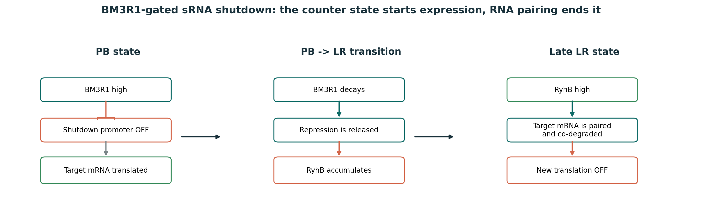
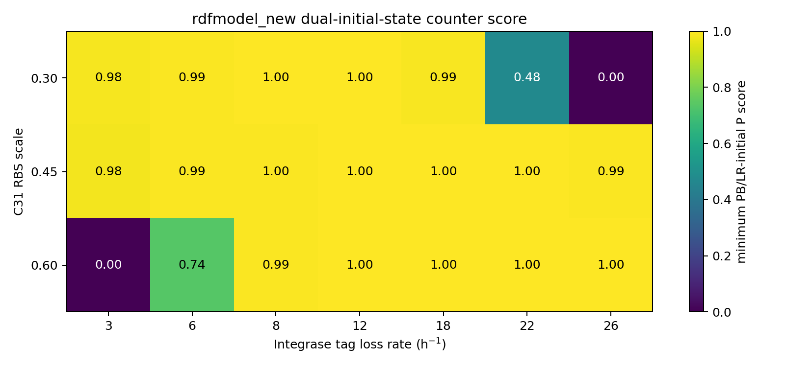
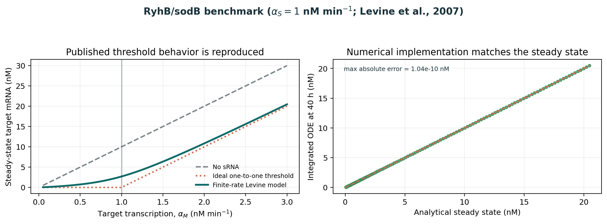
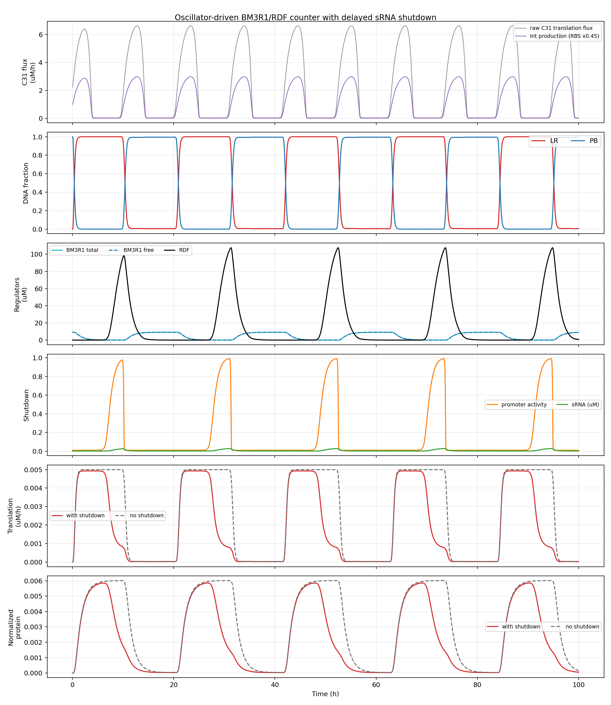
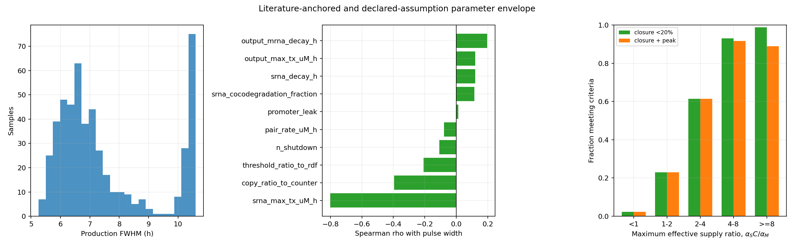
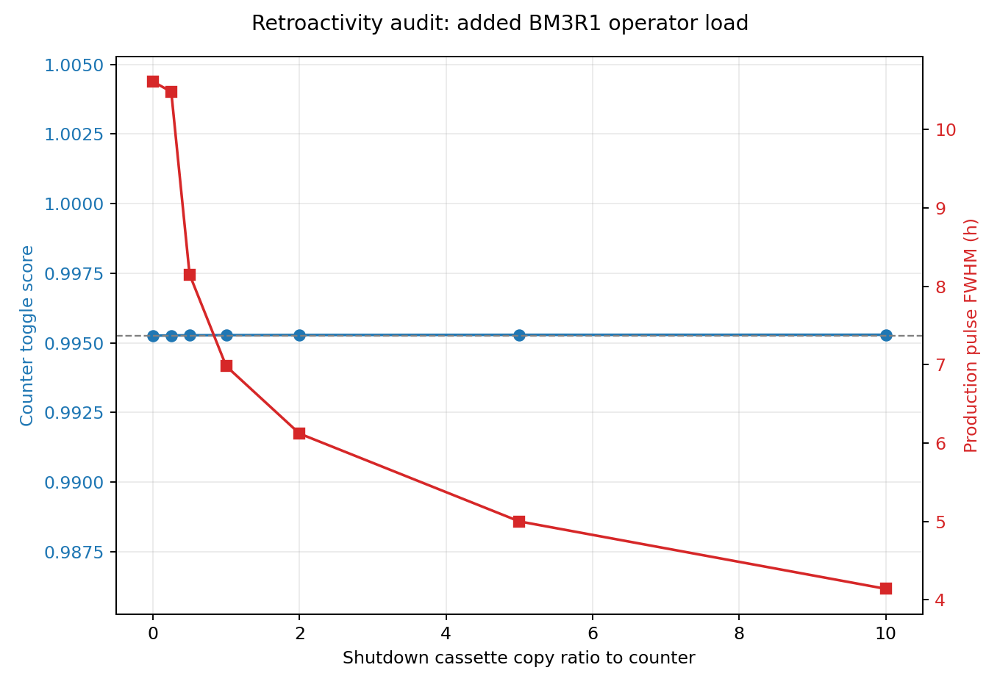

# BM3R1驱动的sRNA Shutdown模块：从持续状态到可调表达窗口

**Wiki叙事版 v1.1**  
**日期：2026-09-09**  
**定位：Model页面正文底稿；技术细节与完整结果见原始建模报告**

> **一句话结论：** 在当前振荡器和φC31/RDF计数器轨迹下，BM3R1下降能够解除对RyhB的抑制，使RyhB消耗目标mRNA，并把持续LR输出转化为有限、可调的新生翻译窗口；这一结论是文献锚定的机制预测，不是wet-lab验证。

## 1. Why We Needed a Shutdown Module

φC31计数器翻转后会保持稳定DNA状态。如果输出基因直接由LR状态驱动，它会在整个LR阶段持续产生mRNA和蛋白，而项目需要的是“计数状态到达后表达一段时间，再停止新的输出产生”。因此，我们没有再引入独立时钟，而是利用计数器中原有的BM3R1延迟下降作为关闭计时信号。

这个问题包含两个不同层次：

1. **局部Shutdown问题：** 某个计数状态已经进入LR后，能否把持续输出缩短成有限脉冲？
2. **完整计数逻辑问题：** 多位计数器数到哪个状态时，应由哪一位或哪个状态解码器启动最终输出？

本报告完成第一个问题。第二个问题需要结合实验组最终计数拓扑和目标次数决定，当前不预设答案。

> **Pending design decision：** 当前模型是单个PB/LR bit的局部Shutdown读出。它不能单独证明“计数到指定数字N时只输出一次”。Wiki不得把这两件事合并表述。

> **为什么无Shutdown对照只有约10小时？** 这里的10.61 h来自当前单bit测试：该bit每次输入就在PB与LR之间交替，因此一次LR驻留只维持约一个输入间隔。它不是完整多bit计数器中持续表达时间的上限。若最终状态译码使输出在连续多个计数周期保持开启，无Shutdown表达会跨越多个输入间隔，可能远长于10.61 h；其确切长度必须等实验组确定计数位、目标状态和复位逻辑后再计算。Shutdown模块的意义因此不只是把10.61 h缩短到6.98 h，而是让输出能够在不等待DNA状态离开目标计数状态的情况下自行停止新翻译。

## 2. Circuit Concept



**图1｜Shutdown工作机制。** PB状态下BM3R1保持高水平并抑制Shutdown promoter；PB转为LR后，BM3R1停止产生并逐渐下降，RyhB随后积累；RyhB与目标mRNA配对并共同降解，从而停止新的翻译。这个模块关闭的是mRNA与新生翻译，不会主动清除已经合成的稳定蛋白。

其核心逻辑可以写成：

```text
LR state AND low BM3R1 -> RyhB production -> target-mRNA removal -> translation shutdown
```

## 3. Model Construction

### 3.1 Oscillator-to-counter interface

振荡器提供C31翻译通量，计数器输入定义为：

$$
v_{\mathrm{Int}}(t)=0.45v_{31}(t).
$$

计数器直接使用`rdfmodel_new/model/zhao_core.py`中的38状态φC31 integrase/RDF反应网络。该网络结构依据Zhao等人的单输入二进制计数器模型；当前C31 RBS比例、Integrase标签损失率和BM3R1/RDF表达工作点来自本项目的接口筛选，不是Zhao论文中的原始常数。[Zhao et al., 2019](https://doi.org/10.1093/nar/gkz245)

双初态审计显示，选定工作点的最低P score为0.99526，5个稳定输入周期全部恰好发生一次完整反转。



**图2｜振荡器-计数器接口筛选。** 选定组合位于PB和LR两种初态均能正确工作的区域。

### 3.2 Shutdown equations

BM3R1对Shutdown promoter的抑制写成：

$$
H(B)=\ell+(1-\ell)\frac{1}{1+[B/(r_KK_{\mathrm{RDF}})]^n}.
$$

新增状态为sRNA浓度$S$、目标mRNA浓度$M$和归一化蛋白读出$O$：

$$
\frac{dS}{dt}=\alpha_SH(B)-\beta_SS-pkSM,
$$

$$
\frac{dM}{dt}=\alpha_Mf_{LR}-\beta_MM-kSM,
$$

$$
\frac{dO}{dt}=\beta_{tr}M-(\delta_O+\mu)O.
$$

配对通量$kSM$同时消耗mRNA和sRNA。基准$p=1$表示Levine理论中的理想一对一共同降解极限，而不是直接测得的RyhB常数；参数分析另外扫描$p=0.5-1$。[Levine et al., 2007](https://doi.org/10.1371/journal.pbio.0050229) 这一修正确保模型不会无物理依据地积累sRNA。

## 4. Literature Benchmark and Implementation Check

使用Levine给出的RyhB/sodB参数，在恒定满诱导条件下计算模型稳态。有限配对速率模型重现了文献描述的平滑阈值响应：当目标mRNA转录供给低于RyhB供给时，目标mRNA接近关闭；超过供给阈值后，未被消耗的mRNA开始积累。[Levine et al., 2007](https://journals.plos.org/plosbiology/article?id=10.1371/journal.pbio.0050229)



**图3｜Levine方程基准与数值实现检查。** 左图比较无sRNA、理想一对一阈值和有限配对速率响应；右图比较解析稳态与40 h ODE积分终点。最大mRNA绝对误差为$1.04\times10^{-10}$ nM。

这张图证明的是方程实现与解析模型一致，并证明当前参数能够重现Levine模型的阈值机制。它不是独立wet-lab验证，也没有证明BM3R1 promoter可以实现全部扫描转录率。

## 5. Parameterization

|参数|模型基准值|文献原始值与换算|直接来源及底层依据|
|---|---:|---|---|
|RyhB最大转录率$\alpha_S$|0.06 µM h⁻¹|基准采用1 nM min⁻¹：$1\times60/1000=0.06$ µM h⁻¹；文献估计范围0.1-10 nM min⁻¹|Levine 2007 Figure 1C、Table 1和“Estimation of model parameters”使用该参考值及范围 [[Levine 2007]](https://journals.plos.org/plosbiology/article?id=10.1371/journal.pbio.0050229)|
|目标mRNA转录率$\alpha_M$|0.03 µM h⁻¹|项目基准取0.5 nM min⁻¹：$0.5\times60/1000=0.03$ µM h⁻¹；不是论文直接给定点|Levine 2007根据约10-20 copies cell⁻¹估计表达态约1 nM min⁻¹，并指出通常约10倍变化；底层转录组数据来自Zhang 2005和Selinger 2000 [[Levine 2007]](https://journals.plos.org/plosbiology/article?id=10.1371/journal.pbio.0050229) [[Zhang 2005]](https://doi.org/10.1128/JB.187.3.980-990.2005) [[Selinger 2000]](https://doi.org/10.1038/82367)|
|RyhB有效周转率$\beta_S$|1.2 h⁻¹|Levine估计$1/50\ \mathrm{min}^{-1}\approx0.02\ \mathrm{min}^{-1}$；$0.02\times60=1.2$ h⁻¹|Levine 2007“Estimation of model parameters”；其约30 min RyhB半衰期依据Massé 2003与Moll 2003。这里沿用论文的近似有效率，不重新按$\ln2/t_{1/2}$计算 [[Massé 2003]](https://doi.org/10.1101/gad.1127103) [[Moll 2003]](https://doi.org/10.1261/rna.5850703)|
|目标mRNA有效周转率$\beta_M$|6 h⁻¹|Levine根据约6 min的`sodB`半衰期取$1/10\ \mathrm{min}^{-1}\approx0.1\ \mathrm{min}^{-1}$；$0.1\times60=6$ h⁻¹|Levine 2007“Estimation of model parameters”，底层`sodB`实验来自Massé 2003 [[Levine 2007]](https://journals.plos.org/plosbiology/article?id=10.1371/journal.pbio.0050229) [[Massé 2003]](https://doi.org/10.1101/gad.1127103)|
|配对速率$k$|1200 µM⁻¹ h⁻¹|Levine估计$1/50=0.02$ nM⁻¹ min⁻¹；$0.02\times1000\times60=1200$ µM⁻¹ h⁻¹|Levine 2007根据Massé 2003中RyhB在靶标存在时约3 min内消失、靶mRNA约20 nM推得；不是直接测得的结合常数 [[Levine 2007]](https://journals.plos.org/plosbiology/article?id=10.1371/journal.pbio.0050229) [[Massé 2003]](https://doi.org/10.1101/gad.1127103)|
|共同降解比例$p$|1；扫描0.5-1|基准取Levine理论的一对一极限；无单位换算|Levine 2007理论模型情形，不是实验辨识的RyhB常数 [[Levine 2007]](https://doi.org/10.1371/journal.pbio.0050229)|
|BM3R1 Hill系数$n$|3.1|直接采用，无单位换算|Shin 2020 B3-BM3R1 gate拟合参数 [[Shin 2020]](https://doi.org/10.15252/msb.20199401)|
|promoter leak|0.00833|由同一gate的$y_{min}/y_{max}=0.005/0.6=0.00833$归一化|Shin 2020 B3-BM3R1 gate；这是由文献测量值派生的无量纲量 [[Shin 2020]](https://doi.org/10.15252/msb.20199401)|
|相对阈值$r_K$|1；扫描0.5-2|没有绝对单位换算|项目设计假设：默认复用RDF的BM3R1 operator；不是文献常数|
|Shutdown/counter剂量比$C$|1|没有单位换算|项目设计假设：每个counter plasmid一个Shutdown cassette；不是文献常数|

单位换算仅改变数值表示，不会提高参数的证据等级。上表因此同时区分“论文直接采用或估计的数值”“论文引用的底层实验”和“本项目选择的设计点”。

BM3R1 gate参数来自Shin等人的B3-BM3R1测量，但其阈值以RPU表示，不能直接转换为模型中的BM3R1浓度。因此模型只采用Hill系数和归一化leak，并把Shutdown阈值表示为相对RDF阈值$r_K$。[Shin et al., 2020](https://doi.org/10.15252/msb.20199401)

### RyhB sequence boundary

模型采用*E. coli* K-12 MG1655 RyhB作为文献代理。NCBI当前注释为Gene ID 2847761、`NC_000913.3 complement(3580922..3581016)`，长度95 nt。[NCBI Gene 2847761](https://www.ncbi.nlm.nih.gov/gene/2847761)

Levine实验使用RyhB `+1..+96`克隆片段和`sodB -1..+88`靶控制区。当前ODE不读取碱基序列，而是把序列、Hfq和RNase E作用折叠到有效配对速率$k$中。因此：

- 95/96 nt边界差异不影响当前ODE数值；
- 如果未来合成构建，应回查原质粒测序确认3'端；
- 如果更换目标mRNA或不使用相容`sodB`调控片段，当前$k$不能直接沿用；
- RyhB是天然多靶点sRNA，内源靶标竞争和铁代谢扰动尚未建模。[Hao et al., 2011](https://doi.org/10.1073/pnas.1100432108)

## 6. How We Measured a Shutdown Pulse

所有时间指标均按稳定阶段的单次PB→LR事件计算：

1. 以LR fraction向上穿越0.5定义PB→LR开始，并跳过第一个瞬态事件；
2. 在该LR阶段内测量新生翻译通量峰值；
3. FWHM定义为新生翻译通量不低于单周期峰值50%的首末时间差；
4. “LR后期残留”是在LR仍有效时，最后20% LR区间内新生翻译通量均值与峰值的比值；
5. 工程通过标准为有限FWHM、LR后期残留低于20%、峰值不低于对应无Shutdown对照的50%；
6. 20%与50%是预先声明的项目判据，不是文献生物学常数。

因此，报告中的`6.98 h`表示**新生翻译通量的半峰宽**，不是稳定蛋白从产生到消失的时间。

## 7. Baseline Result: The Persistent State Becomes a Finite Window

50 min名义倍增时间下，当前单bit测试得到：

|指标|当前单bit无Shutdown|当前单bit加入Shutdown|变化|
|---|---:|---:|---:|
|新生翻译通量FWHM|10.61 h|6.98 h|缩短34.2%|
|LR后期新生翻译/峰值|97.9%|17.0%|降低82.6%|
|新生翻译峰值|0.004999 µM h⁻¹|0.004930 µM h⁻¹|保留98.6%|
|稳定蛋白FWHM|10.63 h|7.33 h|下降较慢|
|LR后期稳定蛋白/峰值|99.8%|32.0%|未达到20%|



**图4｜完整耦合时间过程。** 红线为带Shutdown的新生翻译通量，灰色虚线为无Shutdown对照。Shutdown保留前期输出，但在LR后段清除mRNA并停止新翻译；已经形成的稳定蛋白需要更长时间被稀释。

这里的34.2%缩短幅度只比较同一条单bit轨迹，不能代表完整多bit系统中Shutdown的全部收益。多bit系统若让目标输出状态跨越$m$个输入间隔保持有效，则无Shutdown持续时间会随该状态驻留周期数增长，可粗略写成$T_{\mathrm{no\ shutdown}}\sim mT_{\mathrm{input}}$；具体$m$取决于尚未冻结的计数状态译码。当前6.98 h是Shutdown局部动力学给出的关闭窗口，而10.61 h是本次单bit对照的状态驻留尺度，两者不能被外推为多bit系统的固定值。

## 8. Can We Tune the Expression Window?

### 8.1 sRNA strength and BM3R1 threshold

169个$\alpha_S-r_K$组合中有91个满足关闭和峰值判据，可行的新生翻译FWHM为5.42-7.36 h。固定其他参数时，提高RyhB转录率或提高Shutdown对BM3R1的相对阈值都会提前关闭。


**图5｜表达时间的可调域。** 灰色区域表示无法同时满足后期关闭和峰值保留要求。

### 8.2 The supply-ratio design rule

共同降解意味着RyhB必须有足够的物质供给。定义有效供给比：

$$
R_{\mathrm{supply}}=\frac{\alpha_SC}{\alpha_M}.
$$

225点转录供给扫描中有124点通过；离散网格最低可行比值为1.39，各目标mRNA水平最低可行比值的中位数为2.68。


**图6｜转录供给相图。** $\alpha_S=\alpha_M$附近通常不能可靠关闭，说明“存在sRNA”并不等于“sRNA供给足以关闭输出”。

512点联合参数包络进一步显示：

|有效供给比|满足联合标准的比例|设计解释|
|---|---:|---|
|<1|2.3%|应避免|
|1-2|23.0%|高度依赖其他参数|
|2-4|61.3%|存在可行域，但仍需筛选|
|4-8|91.7%|当前模型中优先验证的稳健区间|
|≥8|89.0%|关闭更完整，但部分组合开始损失峰值|

这里的比例是所声明参数包络的覆盖率，不是实验成功概率。

## 9. Robustness and Coupling Back to the Counter



**图7｜512点拉丁超立方联合包络。** 277/512组满足联合标准，脉宽中位数为6.86 h；RyhB最大转录率是影响脉宽和关闭完整度的首要参数。参数被独立抽样，因此这不是实验后验分布。

增加Shutdown cassette剂量能够提高RyhB供给，但新增BM3R1 operator也会结合BM3R1，因此剂量不是与RDF delay完全独立的旋钮。当前快速平衡负载模型下，拷贝比1使最低游离BM3R1约为总量的50.6%，计数器P score仍由0.995260变为0.995278，5/5周期保持一次完整反转。



**图8｜Operator负载审计。** 当前模型没有观察到反转保真度下降，但真实拷贝数、BM3R1结合常数和DNA负载仍需构建特异标定。

在40、50和60 min倍增条件下，新生翻译FWHM分别为5.48、6.98和8.54 h，且均维持一峰一次反转。生长变慢会同步延长振荡周期和输出窗口，因此必须按预期培养条件重新标定绝对时间。


**图9｜生长条件分析。** 每种条件都使用自己的无Shutdown对照，避免把生长造成的峰值变化误判为Shutdown失效。

## 10. What the Model Changed in Our Design

|模型发现|对设计的影响|
|---|---|
|持续LR状态本身不会产生有限输出|必须增加转录后Shutdown，而不能只依赖DNA状态|
|RyhB共同降解会同时消耗sRNA|方程必须包含$-pkSM$，不能把RyhB当作不耗竭催化剂|
|等转录供给通常关闭不足|设计时需要显式计算$\alpha_SC/\alpha_M$|
|4-8供给比在当前包络中最稳定|优先在该区间选择或模拟promoter与cassette剂量|
|提高cassette剂量会增加BM3R1负载|先调RyhB promoter或operator阈值，再把高拷贝作为次选方案|
|生长速度决定绝对窗口长度|不能把6.98 h当作跨培养条件常数|
|稳定蛋白不会被RyhB直接清除|若功能要求蛋白快速下降，应指定蛋白并增加有依据的降解标签|

最核心的工程贡献不是预测一个固定脉宽，而是给出了一个可操作的设计约束：**RyhB有效转录供给必须高于目标mRNA供给，并在关闭完整度和峰值保留之间寻找平衡。**

## 11. What the Model Does Not Yet Prove

- 尚未确定Shutdown接到哪一位或哪个目标计数状态解码器；
- 没有wet-lab数据，不能声称构建已被验证；
- BM3R1的RPU到细胞内浓度映射尚未标定；
- RyhB/目标mRNA序列没有进入逐碱基动力学模型；
- Hfq容量、RNase E饱和和RyhB内源靶标竞争未显式建模；
- 输出蛋白尚未指定，当前蛋白曲线只是稳定GFP型归一化读出；
- 512点参数包络是假设空间探索，不是成功率估计。

这些限制不否定局部Shutdown机制的可行域，但限制了模型对具体构建和完整多位计数系统的预测能力。

## 12. Reproducibility

主要文件：

```text
shutdown_core.py                  coupled ODE and metrics
run_analysis.py                   baseline and two-dimensional scans
run_extended_analysis.py          growth, OAT and joint envelope
build_wiki_assets.py              mechanism and Levine benchmark figures
outputs/.../00_parameter_provenance.csv
outputs/.../summary.json
outputs/.../extended_summary.json
```

复现命令：

```powershell
python -m py_compile shutdown_core.py run_analysis.py run_extended_analysis.py build_wiki_assets.py verify_model.py
python verify_model.py
python build_wiki_assets.py
```

完整参数表、输入轨迹、逐周期指标、扫描CSV和绘图代码均随交付包提供。

## 13. Suggested Wiki Layout

正式Wiki页面建议保留图1、图3、图4、图6、图7和第10节中的设计决策表作为主线；计数器接口、Operator负载和完整参数表可以放入折叠区或下载附件。页面顶部先给出问题和结论，再展示机制和验证，最后才展开方程与参数，这样非建模背景的评审也能理解模型如何改变了设计。

## References

1. Zhao, J. et al. A single-input binary counting module based on serine integrase site-specific recombination. *Nucleic Acids Research* **47**, 4896-4909 (2019). https://doi.org/10.1093/nar/gkz245
2. Levine, E., Zhang, Z., Kuhlman, T. & Hwa, T. Quantitative characteristics of gene regulation by small RNA. *PLoS Biology* **5**, e229 (2007). https://doi.org/10.1371/journal.pbio.0050229
3. Shin, J., Zhang, S., Der, B. S., Nielsen, A. A. K. & Voigt, C. A. Programming *Escherichia coli* to function as a digital display. *Molecular Systems Biology* **16**, e9401 (2020). https://doi.org/10.15252/msb.20199401
4. Hao, Y. et al. Quantifying the sequence-function relation in gene silencing by bacterial small RNAs. *PNAS* **108**, 12473-12478 (2011). https://doi.org/10.1073/pnas.1100432108
5. Massé, E., Escorcia, F. E. & Gottesman, S. Coupled degradation of a small regulatory RNA and its mRNA targets in *Escherichia coli*. *Genes & Development* **17**, 2374-2383 (2003). https://doi.org/10.1101/gad.1127103
6. Prévost, K. et al. Small RNA-induced mRNA degradation achieved through both translation block and activated cleavage. *Genes & Development* **25**, 385-396 (2011). https://doi.org/10.1101/gad.2001711
7. NCBI Gene. *ryhB* [*E. coli* K-12 MG1655], Gene ID 2847761. https://www.ncbi.nlm.nih.gov/gene/2847761
8. Zhang, Z. et al. Functional interactions between the carbon and iron utilization regulators, Crp and Fur, in *Escherichia coli*. *Journal of Bacteriology* **187**, 980-990 (2005). https://doi.org/10.1128/JB.187.3.980-990.2005
9. Selinger, D. W. et al. RNA expression analysis using a 30 base pair resolution *Escherichia coli* genome array. *Nature Biotechnology* **18**, 1262-1268 (2000). https://doi.org/10.1038/82367
10. Moll, I. et al. Coincident Hfq binding and RNase E cleavage sites on mRNA and small regulatory RNAs. *RNA* **9**, 1308-1314 (2003). https://doi.org/10.1261/rna.5850703
